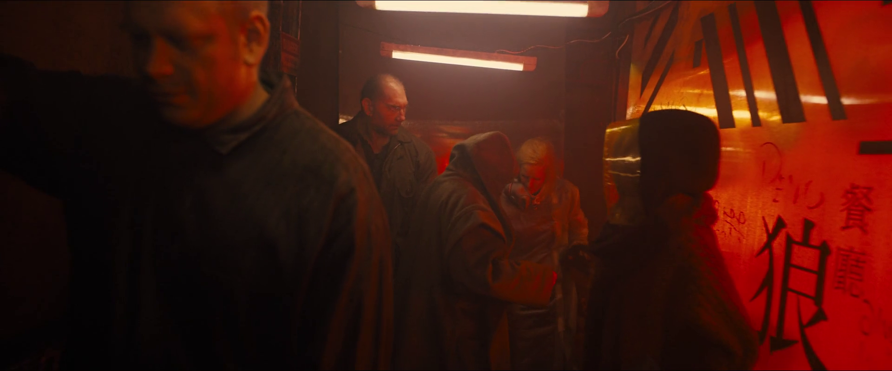
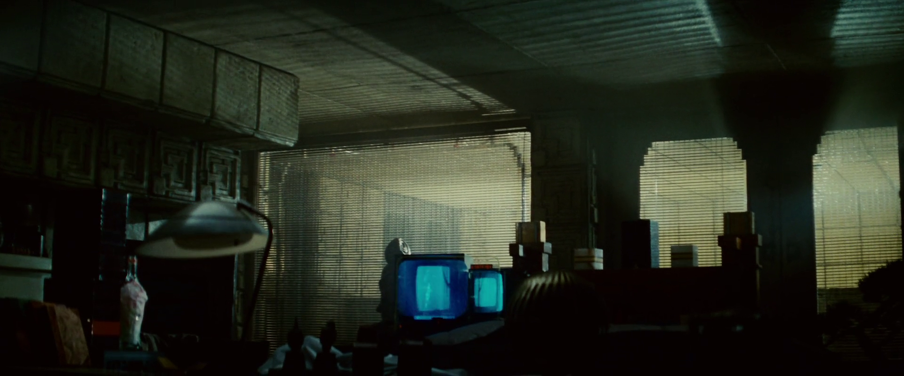

پشت فیلم
blade runner
ایده جذابی هست که من خیلی دوست دارم.
کلیت داستان به این شکل هست که دنیا تونسته از انسان
clone
هایی بسازه و از اونها برای پیشرفت و کار های سخت استفاده کنه،
مثلا توی جنگ بجای سرباز واقعی استفاده می‌شن،
اگه قراره ماموریت خطرناکی مثل اکتشاف توی فضا و یا دستگیری یک مجرم خطرناک کسی رو بفرستن،
چی بهتر از یه کلون که جون انسان واقعی به خطر نیوفته؟

اما از جایی به بعد کلون ها تغییر می‌کنند و دیگه برده بودن رو قبول نمی‌کنن،
سعی می‌کنن فرار کنند و دستور انسان ها سرپیچی کنند.
اما اینکار هم فایده‌ای نداره، چون انسان ها کلون های دیگه‌ای می‌سازند
که کارشون پیدا کردن و کشتن کلون هایی هست که فرار کردن،
به این شغل که مامولا شغل کلون ها هست می‌گن
blade runner.

این روند یکم شبیه یک
loop
هست، ساخت
clone
هایی که
clone
ها رو بکشه
درصورتی که همین
clone
ها فرار می‌کنند و دوباره
clone
های دیگه‌ای میان سراغ اینها.

باید بگم که
balde runner
چندین سری فیلم هست،
حتی یک سریال انیمیشنی هم داره.

---

